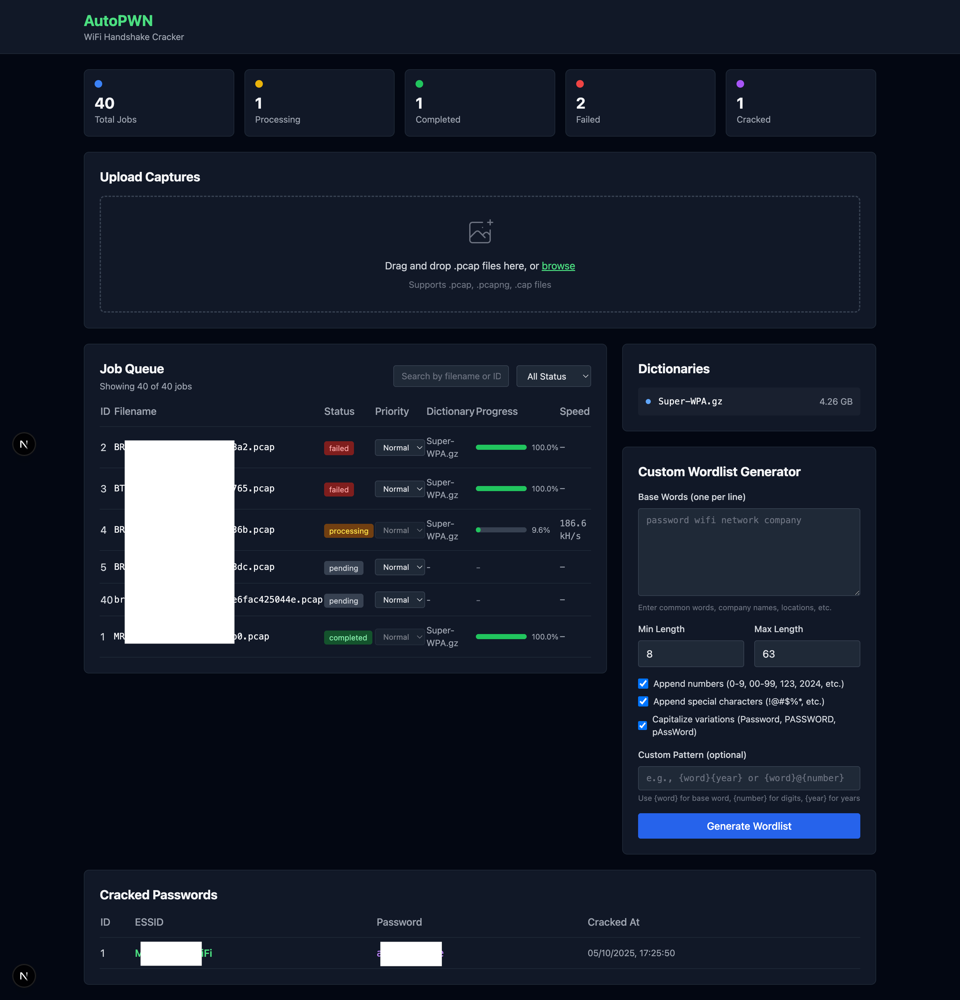

# AutoPWN (⌐■_■)

Automated WPA/WPA2 handshake cracker with a modern web dashboard. Drop `.pcap` files, let AutoPWN handle the rest.


[](https://hub.docker.com/r/doomedramen/autopwn-worker)
[](https://hub.docker.com/r/doomedramen/autopwn-web)
[](https://hub.docker.com/r/doomedramen/autopwn-worker)



## Table of Contents

- [Features](#features)
- [Architecture](#architecture)
- [Quick Start](#quick-start)
- [Dashboard Features](#dashboard-features)
- [Configuration](#configuration)
- [GPU Support](#gpu-support)
- [API Documentation](#api-documentation)
- [Development](#development)
- [Troubleshooting](#troubleshooting)
- [Security Notice](#security-notice)
- [Contributing](#contributing)
- [License](#license)

## Features

### Core
- **Automated Processing**: Watches input folder for `.pcap` files
- **Sequential Dictionary Attack**: Tries all dictionaries until success
- **Multi-GPU Support**: NVIDIA, AMD, Intel, and CPU modes
- **Potfile Integration**: Instantly retrieves previously cracked passwords
- **Web Upload**: Drag-and-drop `.pcap` files directly in the dashboard

### Dashboard
- **Real-time Monitoring**: Live job queue with progress, speed, and ETA
- **Job Management**: View logs, retry failed jobs, pause/resume processing
- **Search & Filter**: Filter jobs by status, search by filename or ID
- **Priority Queue**: Set job priority (Low, Normal, High, Urgent)
- **Custom Wordlists**: Generate targeted wordlists with patterns and transformations
- **Results Tracking**: View all cracked passwords with timestamps
- **Analytics Dashboard**: Track success rates, completion times, and dictionary effectiveness
- **Batch Processing**: Combine multiple PCAP files into efficient batch jobs

## Architecture

```
AutoPWN
├── Worker Service
│   ├── File watcher (chokidar)
│   ├── PCAP to hc22000 converter (hcxpcapngtool)
│   └── Hashcat job processor
├── Web Dashboard (Next.js)
│   ├── Job queue viewer
│   ├── Live statistics
│   └── Results table
└── SQLite Database
```

## Quick Start

### 1. Clone and Setup

```bash
git clone <repo>
cd autopwn
cp .env.example .env
```

### 2. Add Dictionaries

Place your wordlists in `volumes/dictionaries/`:

```bash
cp /path/to/rockyou.txt volumes/dictionaries/
cp /path/to/Super-WPA.gz volumes/dictionaries/
```

### 3. Run with Docker Compose

#### Option A: Pre-built Images (Recommended)

Pull and run pre-built images from Docker Hub:

```bash
# CPU Mode (default)
docker-compose up -d

# NVIDIA GPU
docker-compose -f docker-compose.yml -f docker-compose.nvidia.yml up -d

# AMD GPU
docker-compose -f docker-compose.yml -f docker-compose.amd.yml up -d
```

#### Option B: Build Locally

Build from source instead of pulling from Docker Hub:

```bash
# Add --build flag
docker-compose up -d --build
```

### 4. Access Dashboard

Open http://localhost:3000

### 5. Add PCAP Files

Drop `.pcap` files into `volumes/input/`:

```bash
cp handshake.pcap volumes/input/
```

AutoPWN will:
1. Move file to `intermediate/`
2. Convert to `.hc22000` format
3. Run hashcat against all dictionaries
4. Move to `completed/` (if cracked) or `failed/`

## Configuration

Edit `.env` file:

```bash
# GPU Type: nvidia, amd, intel, cpu
HASHCAT_DEVICE_TYPE=cpu

# Paths (inside container)
DATABASE_PATH=/data/db/autopwn.db
DICTIONARIES_PATH=/data/dictionaries
INPUT_PATH=/data/input
INTERMEDIATE_PATH=/data/intermediate
COMPLETED_PATH=/data/completed
FAILED_PATH=/data/failed
HASHES_PATH=/data/hashes

# Batch Processing
BATCH_MODE_ENABLED=false
BATCH_QUIET_PERIOD=60
BATCH_MAX_WAIT=300
BATCH_MIN_FILES=1
BATCH_MAX_FILES=50
```

## Directory Structure

```
autopwn/
├── volumes/
│   ├── dictionaries/    # Your wordlists
│   ├── input/           # Drop .pcap files here
│   ├── intermediate/    # Processing area
│   ├── completed/       # Successful cracks
│   ├── failed/          # Failed attempts
│   ├── hashes/          # .hc22000 files
│   └── db/              # SQLite database
├── packages/
│   ├── shared/          # Shared TypeScript types
│   ├── worker/          # File watcher + processor
│   └── web/             # Next.js dashboard
└── docker-compose.yml
```

## GPU Support

### NVIDIA

Requirements:
- NVIDIA Docker runtime (`nvidia-docker2`)
- CUDA drivers

```bash
# Install nvidia-docker
distribution=$(. /etc/os-release;echo $ID$VERSION_ID)
curl -s -L https://nvidia.github.io/nvidia-docker/gpgkey | sudo apt-key add -
curl -s -L https://nvidia.github.io/nvidia-docker/$distribution/nvidia-docker.list | \
  sudo tee /etc/apt/sources.list.d/nvidia-docker.list
sudo apt-get update && sudo apt-get install -y nvidia-docker2
sudo systemctl restart docker
```

### AMD

Requirements:
- ROCm drivers
- Access to `/dev/kfd` and `/dev/dri`

```bash
# Add user to video group
sudo usermod -a -G video $USER
```

### Intel

Uses OpenCL. Typically works out of the box with Intel OpenCL runtime.

## API Documentation

AutoPWN provides a REST API for automation and integration. See [API.md](API.md) for detailed documentation of all endpoints.

Key API features:
- Job management (create, pause, resume, retry)
- File upload and dictionary management
- Real-time statistics and analytics
- Results export and querying

Example usage:
```bash
# Get all jobs
curl http://localhost:3000/api/jobs

# Upload a file
curl -X POST -F "files=@handshake.pcap" http://localhost:3000/api/upload

# Set job priority
curl -X POST -H "Content-Type: application/json" \
  -d '{"priority":2}' \
  http://localhost:3000/api/jobs/1/priority
```

## Dashboard Features

### Statistics
- **Live Stats Cards**: Total jobs, processing, completed, failed, cracked passwords
- **Auto-refresh**: Updates every 2-3 seconds
- **Analytics Dashboard**: Visual charts showing job trends, success rates, and dictionary effectiveness

### Job Queue
- **Real-time Progress**: Track progress, speed, ETA for each job
- **Search & Filter**: Filter by status (pending/processing/completed/failed), search by filename/ID
- **Priority Management**: Set job priority (Urgent/High/Normal/Low)
- **Pause/Resume**: Control job processing
- **View Logs**: Inspect detailed job logs
- **Retry Failed**: Re-queue failed jobs with one click

### Wordlist Generator
- **Base Words**: Enter common words, company names, locations
- **Transformations**:
  - Number appending (0-9, 00-99, years 2020-2025)
  - Special characters (!@#$%*, etc.)
  - Capitalization (Title Case, UPPER CASE, leet speak)
- **Custom Patterns**: Use `{word}`, `{number}`, `{year}` placeholders
- **Length Filtering**: Set min/max password length (8-63 for WPA)

### Results
- **Cracked Passwords**: View all successful cracks with ESSID and timestamp
- **Export Ready**: Results stored in SQLite database
- **Analytics**: Historical data with charts and statistics

## Development

### Local Setup

```bash
# Install dependencies
npm install

# Run worker
npm run dev:worker

# Run web (in another terminal)
npm run dev:web
```

### Build

```bash
npm run build
```

## Troubleshooting

### No jobs appearing

- Check file watcher logs: `docker logs autopwn-worker`
- Ensure `.pcap` files are valid
- Check folder permissions

### Hashcat not finding GPU

- Verify GPU support: `docker exec autopwn-worker hashcat -I`
- Check device type in `.env`
- For NVIDIA: `nvidia-smi` should work in container
- For AMD: Check `/dev/dri` and `/dev/kfd` access

### Dashboard not updating

- Check database file exists: `ls volumes/db/`
- Verify web container can read database: `docker logs autopwn-web`

## Stack

- **Worker**: Node.js 24 + TypeScript + chokidar + better-sqlite3
- **Web**: Next.js 15 + React 19 + Tailwind CSS
- **Tools**: hashcat + hcxpcapngtool
- **Database**: SQLite3 (WAL mode)

## Security Notice

⚠️ **IMPORTANT**: This tool is for **authorized security testing and educational purposes only**.

- Only use on networks you **own** or have **explicit written permission** to test
- Unauthorized access to computer networks is **illegal** and punishable by law
- The developers assume **no liability** for misuse of this software
- By using AutoPWN, you agree to use it responsibly and ethically

## Contributing

Contributions are welcome! Please read [CONTRIBUTING.md](CONTRIBUTING.md) for details on our code of conduct and the process for submitting pull requests.

### Roadmap

- [x] Analytics dashboard with charts and statistics
- [ ] Mobile-responsive UI
- [x] Batch job management
- [ ] Email/webhook notifications
- [ ] Custom hashcat rules support
- [x] API endpoints for automation

## License

MIT License - see [LICENSE](LICENSE) file for details.

## Acknowledgments

- [hashcat](https://hashcat.net/hashcat/) - Advanced password recovery
- [hcxtools](https://github.com/ZerBea/hcxtools) - PCAP conversion utilities
- Built with [Next.js](https://nextjs.org/) and [Tailwind CSS](https://tailwindcss.com/)
