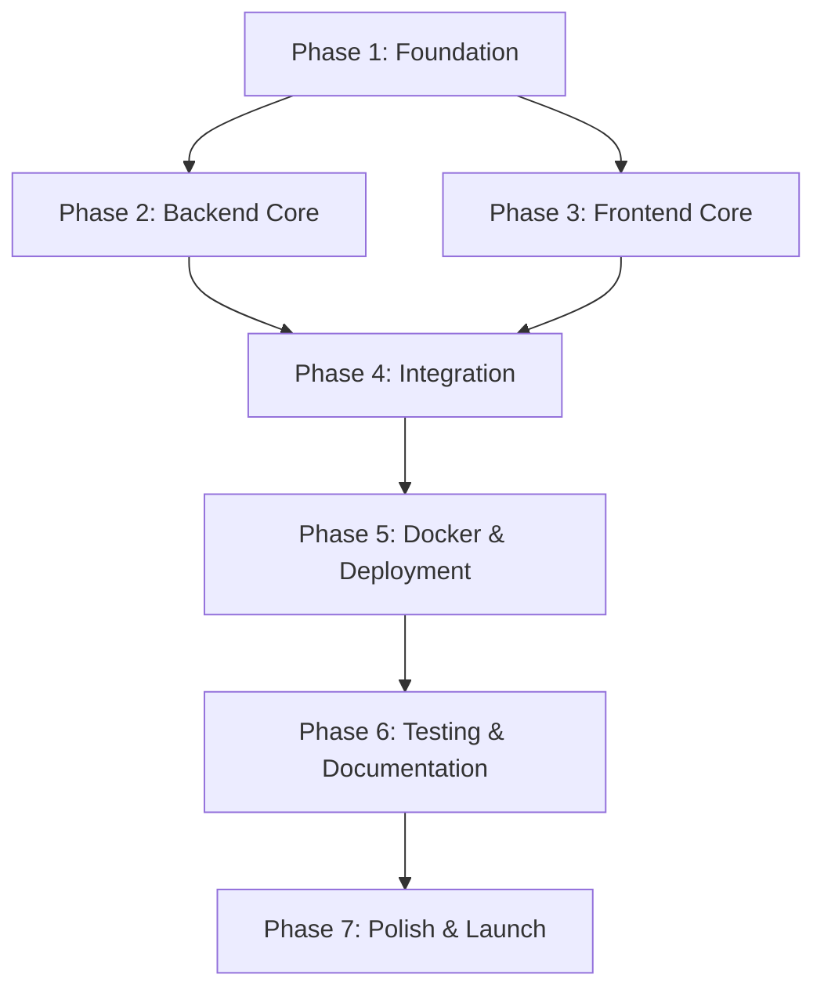

# Project Plan & Implementation Roadmap

Complete implementation plan for autopwn from monorepo to production-ready application.

## Table of Contents

- [Project Overview](#project-overview)
- [Success Criteria](#success-criteria)
- [Phases Overview](#phases-overview)
- [Phase 1: Foundation](#phase-1-foundation)
- [Phase 2: Backend Core](#phase-2-backend-core)
- [Phase 3: Frontend Core](#phase-3-frontend-core)
- [Phase 4: Integration](#phase-4-integration)
- [Phase 5: Docker & Deployment](#phase-5-docker--deployment)
- [Phase 6: Testing & Documentation](#phase-6-testing--documentation)
- [Phase 7: Polish & Launch](#phase-7-polish--launch)
- [Dependencies Map](#dependencies-map)
- [Risk Assessment](#risk-assessment)

## Project Overview

**Goal:** Build a production-ready web application for automating WiFi handshake cracking in the Pwnagotchi ecosystem.

**Current Status:** ✅ Monorepo structure created, documentation complete

**Target:** v0.1.0 MVP - Fully functional application deployable via Docker Compose

## Success Criteria

### MVP Success Criteria (v0.1.0)

**Functional Requirements:**

- ✅ Users can register/login with email + password
- ✅ Superuser can create admin and user accounts
- ✅ Users can upload PCAP files (<500MB)
- ✅ System converts PCAP → hc22000 automatically
- ✅ System extracts network information (SSID, BSSID)
- ✅ Users can upload dictionaries
- ✅ Users can generate dictionaries with basic options
- ✅ Users can create hashcat jobs (select networks + dictionaries)
- ✅ Jobs run in queue with configurable concurrency
- ✅ Users can view job progress and results
- ✅ Cracked passwords are stored and displayed
- ✅ Application deployable via `docker compose up -d`

**Technical Requirements:**

- ✅ All configuration via runtime environment variables
- ✅ TypeScript with strict mode
- ✅ Next.js best practices (Server/Client Components)
- ✅ page.tsx + content.tsx pattern for interactive pages
- ✅ Database migrations working
- ✅ Job queue processing reliably
- ✅ Error handling and validation
- ✅ Audit logging for security actions

**Performance Requirements:**

- ✅ Page load time <2 seconds
- ✅ File upload works for 500MB files
- ✅ Job queue handles multiple concurrent jobs
- ✅ Database queries optimized with indexes

**Security Requirements:**

- ✅ Passwords hashed with bcrypt
- ✅ Session-based authentication
- ✅ RBAC (User, Admin, Superuser)
- ✅ SQL injection prevention (parameterized queries)
- ✅ File upload validation

**Deployment Requirements:**

- ✅ Docker images build successfully
- ✅ docker-compose.yml works without modification
- ✅ Environment variables configurable at runtime
- ✅ Volumes persist data correctly
- ✅ Services start in correct order with health checks

## Phases Overview

| Phase                            | Duration | Dependencies | Status         |
| -------------------------------- | -------- | ------------ | -------------- |
| Phase 1: Foundation              | 1-2 days | None         | ✅ Complete    |
| Phase 2: Backend Core            | 5-7 days | Phase 1      | 🔲 Not Started |
| Phase 3: Frontend Core           | 5-7 days | Phase 1      | 🔲 Not Started |
| Phase 4: Integration             | 3-5 days | Phase 2, 3   | 🔲 Not Started |
| Phase 5: Docker & Deployment     | 2-3 days | Phase 4      | 🔲 Not Started |
| Phase 6: Testing & Documentation | 2-3 days | Phase 5      | 🔲 Not Started |
| Phase 7: Polish & Launch         | 1-2 days | Phase 6      | 🔲 Not Started |

**Total Estimated Time:** 19-29 days

---

## Phase 1: Foundation

**Status:** ✅ **COMPLETE**

**Goal:** Set up monorepo structure, shared types, and documentation.

### Tasks

- [x] Create monorepo structure with pnpm workspaces
- [x] Set up TypeScript configuration
- [x] Create shared package with types, schemas, constants
- [x] Create frontend package structure (Next.js)
- [x] Create backend package structure (Fastify)
- [x] Set up linting and formatting (ESLint, Prettier)
- [x] Create comprehensive documentation
  - [x] README.md
  - [x] ARCHITECTURE.md
  - [x] SETUP.md
  - [x] API.md
  - [x] DATABASE.md
  - [x] DEPLOYMENT.md
  - [x] DEVELOPMENT.md
  - [x] ROADMAP.md
- [x] Create docker-compose.dev.yml for development
- [x] Create .env.example files

### Success Criteria

- ✅ Monorepo builds without errors
- ✅ Shared types importable in both apps
- ✅ Documentation is clear and comprehensive
- ✅ Dev environment starts with docker-compose

### Deliverables

- ✅ Working monorepo structure
- ✅ Complete documentation
- ✅ Development environment setup

---

## Phase 2: Backend Core

**Status:** 🔲 **NOT STARTED**

**Goal:** Build backend API with database, authentication, and job queue.

**Dependencies:** Phase 1

**Estimated Duration:** 5-7 days

### 2.1: Database Setup

**Tasks:**

- [ ] Create Drizzle schema for all tables
  - [ ] users table
  - [ ] sessions table
  - [ ] captures table
  - [ ] networks table
  - [ ] dictionaries table
  - [ ] jobs table
  - [ ] job_networks junction table
  - [ ] job_dictionaries junction table
  - [ ] results table
  - [ ] config table
  - [ ] audit_logs table
- [ ] Create database migrations
- [ ] Create seed script for initial data
- [ ] Create database connection with pooling
- [ ] Add indexes for performance

**Success Criteria:**

- ✅ All tables created correctly
- ✅ Migrations run successfully
- ✅ Seed creates superuser account
- ✅ Database connection works from backend

**Deliverables:**

- Schema files in `apps/backend/src/db/schema/`
- Migration files in `apps/backend/src/db/migrations/`
- Seed script at `apps/backend/src/db/seed.ts`

### 2.2: Configuration & Validation

**Tasks:**

- [ ] Create config module reading from environment variables
- [ ] Add validation for required environment variables
- [ ] Add sensible defaults for optional config
- [ ] Create config validation function
- [ ] Test config with different environment variables

**Success Criteria:**

- ✅ Config reads from process.env at runtime
- ✅ Missing required vars fail with clear error
- ✅ Defaults work correctly
- ✅ Config is typed with TypeScript

**Deliverables:**

- `apps/backend/src/config/index.ts`

### 2.3: Authentication (Better Auth)

**Tasks:**

- [ ] Set up Better Auth with Fastify
- [ ] Implement email/password authentication
- [ ] Create session management
- [ ] Implement RBAC middleware (user, admin, superuser)
- [ ] Create auth routes:
  - [ ] POST /api/v1/auth/login
  - [ ] POST /api/v1/auth/logout
  - [ ] GET /api/v1/auth/session
  - [ ] POST /api/v1/auth/change-password
- [ ] Add password hashing with bcrypt
- [ ] Create initial superuser on first start

**Success Criteria:**

- ✅ Users can login with email/password
- ✅ Sessions persist across requests
- ✅ RBAC prevents unauthorized access
- ✅ Passwords hashed securely
- ✅ Superuser auto-created if none exists

**Deliverables:**

- `apps/backend/src/routes/auth.ts`
- `apps/backend/src/middleware/auth.ts`
- `apps/backend/src/middleware/rbac.ts`

### 2.4: User Management

**Tasks:**

- [ ] Create user service
- [ ] Create user routes:
  - [ ] GET /api/v1/users (admin, superuser)
  - [ ] POST /api/v1/users (admin, superuser)
  - [ ] PATCH /api/v1/users/:id (admin, superuser)
  - [ ] DELETE /api/v1/users/:id (admin, superuser)
- [ ] Add pagination to user listing
- [ ] Add search functionality
- [ ] Prevent deletion of last superuser

**Success Criteria:**

- ✅ Admins can create users
- ✅ Superusers can create admins
- ✅ Users can be updated and soft-deleted
- ✅ Last superuser cannot be deleted

**Deliverables:**

- `apps/backend/src/services/user.service.ts`
- `apps/backend/src/routes/users.ts`

### 2.5: Capture Management

**Tasks:**

- [ ] Create capture service
- [ ] Create capture routes:
  - [ ] GET /api/v1/captures
  - [ ] POST /api/v1/captures/upload
  - [ ] GET /api/v1/captures/:id
  - [ ] DELETE /api/v1/captures/:id
- [ ] Implement multipart file upload
- [ ] Validate PCAP file format
- [ ] Check file size limits
- [ ] Store files in configurable directory
- [ ] Create capture database record

**Success Criteria:**

- ✅ Users can upload PCAP files
- ✅ Files saved to correct directory
- ✅ File size validated
- ✅ Database record created
- ✅ Files isolated by user

**Deliverables:**

- `apps/backend/src/services/capture.service.ts`
- `apps/backend/src/routes/captures.ts`

### 2.6: Job Queue Setup (BullMQ)

**Tasks:**

- [ ] Set up Redis connection
- [ ] Create BullMQ queues:
  - [ ] conversion-queue
  - [ ] generation-queue
  - [ ] hashcat-queue
- [ ] Create worker processes
- [ ] Add Bull Board for monitoring
- [ ] Configure queue options (retry, timeout)
- [ ] Test queue with mock jobs

**Success Criteria:**

- ✅ Redis connection works
- ✅ Queues created successfully
- ✅ Jobs can be added and processed
- ✅ Bull Board accessible for monitoring
- ✅ Failed jobs retry correctly

**Deliverables:**

- `apps/backend/src/lib/queue.ts`
- `apps/backend/src/worker.ts`

### 2.7: PCAP Conversion Worker

**Tasks:**

- [ ] Create conversion worker
- [ ] Install hcxpcapngtool in Docker image
- [ ] Execute hcxpcapngtool on PCAP files
- [ ] Parse output for network information
- [ ] Create network records in database
- [ ] Save hc22000 files
- [ ] Update capture status
- [ ] Handle conversion errors

**Success Criteria:**

- ✅ PCAP files converted to hc22000
- ✅ Networks extracted and saved
- ✅ Errors logged and reported
- ✅ Conversion jobs complete successfully

**Deliverables:**

- `apps/backend/src/workers/conversion.worker.ts`
- `apps/backend/src/lib/hcxtools.ts`

### 2.8: Dictionary Management

**Tasks:**

- [ ] Create dictionary service
- [ ] Create dictionary routes:
  - [ ] GET /api/v1/dictionaries
  - [ ] POST /api/v1/dictionaries/upload
  - [ ] POST /api/v1/dictionaries/generate
  - [ ] GET /api/v1/dictionaries/:id
  - [ ] DELETE /api/v1/dictionaries/:id
- [ ] Validate dictionary files
- [ ] Count lines in dictionary
- [ ] Check file size limits

**Success Criteria:**

- ✅ Users can upload dictionaries
- ✅ File validation works
- ✅ Line count calculated
- ✅ Files stored correctly

**Deliverables:**

- `apps/backend/src/services/dictionary.service.ts`
- `apps/backend/src/routes/dictionaries.ts`

### 2.9: Dictionary Generation Worker

**Tasks:**

- [ ] Create generation worker
- [ ] Install crunch in Docker image
- [ ] Implement keyword combinations
- [ ] Implement case variations
- [ ] Implement leet speak transformations
- [ ] Implement special character padding
- [ ] Implement number padding
- [ ] Generate dictionary file
- [ ] Update dictionary status

**Success Criteria:**

- ✅ Dictionaries generated with keywords
- ✅ All transformation options work
- ✅ Generated files are valid
- ✅ Status updated correctly

**Deliverables:**

- `apps/backend/src/workers/generation.worker.ts`
- `apps/backend/src/lib/crunch.ts`

### 2.10: Job Management

**Tasks:**

- [ ] Create job service
- [ ] Create job routes:
  - [ ] GET /api/v1/jobs
  - [ ] POST /api/v1/jobs/create
  - [ ] GET /api/v1/jobs/:id
  - [ ] GET /api/v1/jobs/:id/progress
  - [ ] POST /api/v1/jobs/:id/cancel
  - [ ] DELETE /api/v1/jobs/:id
- [ ] Create job_networks and job_dictionaries records
- [ ] Validate network and dictionary IDs
- [ ] Enqueue job to hashcat-queue

**Success Criteria:**

- ✅ Jobs created with networks and dictionaries
- ✅ Validation prevents invalid jobs
- ✅ Jobs added to queue
- ✅ Job status tracked

**Deliverables:**

- `apps/backend/src/services/job.service.ts`
- `apps/backend/src/routes/jobs.ts`

### 2.11: Hashcat Worker

**Tasks:**

- [ ] Create hashcat worker
- [ ] Install hashcat in Docker image
- [ ] Respect concurrency limits
- [ ] Execute hashcat for each network/dictionary combination
- [ ] Parse hashcat output for progress
- [ ] Update job progress in database
- [ ] Parse potfile for cracked passwords
- [ ] Create result records
- [ ] Handle job cancellation
- [ ] Handle job timeout

**Success Criteria:**

- ✅ Hashcat executes correctly
- ✅ Progress updates in real-time
- ✅ Cracked passwords saved
- ✅ Jobs respect concurrency limits
- ✅ Cancellation works immediately

**Deliverables:**

- `apps/backend/src/workers/hashcat.worker.ts`
- `apps/backend/src/lib/hashcat.ts`

### 2.12: Network & Results Routes

**Tasks:**

- [ ] Create network routes:
  - [ ] GET /api/v1/networks
  - [ ] GET /api/v1/networks/:id
  - [ ] GET /api/v1/networks/by-capture/:captureId
- [ ] Create result routes:
  - [ ] GET /api/v1/results
  - [ ] GET /api/v1/results/by-network/:networkId
  - [ ] GET /api/v1/results/by-job/:jobId

**Success Criteria:**

- ✅ Users can view their networks
- ✅ Users can view their results
- ✅ Results show cracked passwords
- ✅ Pagination works

**Deliverables:**

- `apps/backend/src/routes/networks.ts`
- `apps/backend/src/routes/results.ts`

### 2.13: Configuration Management

**Tasks:**

- [ ] Create config routes (superuser only):
  - [ ] GET /api/v1/config
  - [ ] PATCH /api/v1/config
- [ ] Seed default configuration
- [ ] Validate config updates
- [ ] Log config changes to audit log

**Success Criteria:**

- ✅ Superuser can view config
- ✅ Superuser can update config
- ✅ Changes logged
- ✅ Invalid values rejected

**Deliverables:**

- `apps/backend/src/routes/config.ts`

### 2.14: Audit Logging

**Tasks:**

- [ ] Create audit service
- [ ] Log authentication events
- [ ] Log user management events
- [ ] Log job events
- [ ] Log config changes
- [ ] Include IP address and user agent

**Success Criteria:**

- ✅ All security events logged
- ✅ Logs include context
- ✅ Logs queryable

**Deliverables:**

- `apps/backend/src/services/audit.service.ts`

### 2.15: Error Handling & Validation

**Tasks:**

- [ ] Create custom error classes
- [ ] Add global error handler
- [ ] Validate all request bodies with Zod
- [ ] Return consistent error responses
- [ ] Log errors with stack traces

**Success Criteria:**

- ✅ Errors handled gracefully
- ✅ Error responses consistent
- ✅ Validation errors clear
- ✅ Stack traces logged

**Deliverables:**

- `apps/backend/src/lib/errors.ts`
- `apps/backend/src/middleware/error.ts`

### 2.17: Health Check Endpoint

**Tasks:**

- [ ] Create health check endpoint
- [ ] Check database connection
- [ ] Check file system access
- [ ] Return health status

**Success Criteria:**

- ✅ Endpoint returns 200 when healthy
- ✅ Returns 503 when unhealthy
- ✅ Shows service status

**Deliverables:**

- `apps/backend/src/routes/health.ts`

### Phase 2 Deliverables

- Fully functional backend API
- Working authentication and RBAC
- All database tables and migrations
- Job queue processing PCAP conversion
- Job queue processing dictionary generation
- Job queue processing hashcat jobs
- Complete API documentation

### Phase 2 Success Criteria

- ✅ All API endpoints work
- ✅ Authentication secure
- ✅ Jobs process correctly
- ✅ Database operations fast
- ✅ Configuration runtime-only
- ✅ Error handling robust

---

## Phase 3: Frontend Core

**Status:** 🔲 **NOT STARTED**

**Goal:** Build Next.js frontend with all user-facing features.

**Dependencies:** Phase 1 (can work in parallel with Phase 2)

**Estimated Duration:** 5-7 days

### 3.1: App Structure & Layout

**Tasks:**

- [ ] Create app directory structure
- [ ] Set up route groups:
  - [ ] (auth) - Login/register pages
  - [ ] (dashboard) - Main application pages
  - [ ] admin - Admin pages
- [ ] Create root layout with:
  - [ ] Font optimization (next/font)
  - [ ] Global styles
  - [ ] Metadata
  - [ ] Theme provider (if using dark mode)
- [ ] Create dashboard layout with:
  - [ ] Sidebar navigation
  - [ ] Header with user menu
  - [ ] Responsive design
- [ ] Create loading.tsx for each route
- [ ] Create error.tsx boundaries

**Success Criteria:**

- ✅ Layouts render correctly
- ✅ Navigation works
- ✅ Responsive on mobile
- ✅ Loading states show

**Deliverables:**

- `apps/frontend/src/app/layout.tsx`
- `apps/frontend/src/app/(dashboard)/layout.tsx`
- Navigation components

### 3.2: UI Component Library Setup

**Tasks:**

- [ ] Install shadcn/ui components:
  - [ ] Button
  - [ ] Input
  - [ ] Label
  - [ ] Card
  - [ ] Dialog
  - [ ] Table
  - [ ] Tabs
  - [ ] Progress
  - [ ] Select
  - [ ] Checkbox
  - [ ] Toast
  - [ ] Alert Dialog
  - [ ] Dropdown Menu
  - [ ] Separator
- [ ] Configure Tailwind CSS
- [ ] Create component library structure
- [ ] Add component documentation

**Success Criteria:**

- ✅ All components installed
- ✅ Styling consistent
- ✅ Components accessible

**Deliverables:**

- `apps/frontend/src/components/ui/`

### 3.3: API Client

**Tasks:**

- [ ] Create API client wrapper
- [ ] Add authentication header handling
- [ ] Add error handling
- [ ] Add request/response interceptors
- [ ] Create typed API methods
- [ ] Add loading states

**Success Criteria:**

- ✅ API calls work
- ✅ Authentication handled
- ✅ Errors caught
- ✅ TypeScript types

**Deliverables:**

- `apps/frontend/src/lib/api.ts`

### 3.4: Authentication Pages

**Tasks:**

- [ ] Create login page (page.tsx + content.tsx)
- [ ] Implement login form with validation
- [ ] Set up Better Auth client
- [ ] Handle authentication errors
- [ ] Redirect after login
- [ ] Create auth context/state
- [ ] Add session persistence
- [ ] Add logout functionality

**Success Criteria:**

- ✅ Users can login
- ✅ Sessions persist
- ✅ Errors shown clearly
- ✅ Logout works
- ✅ Protected routes redirect

**Deliverables:**

- `apps/frontend/src/app/(auth)/login/page.tsx`
- `apps/frontend/src/app/(auth)/login/content.tsx`
- `apps/frontend/src/lib/auth.ts`

### 3.5: Dashboard Page

**Tasks:**

- [ ] Create dashboard page (page.tsx + content.tsx)
- [ ] Fetch statistics (capture count, job count, results count)
- [ ] Display recent activity
- [ ] Show active jobs
- [ ] Add quick actions
- [ ] Create statistics cards

**Success Criteria:**

- ✅ Dashboard loads quickly
- ✅ Statistics accurate
- ✅ Recent activity shown
- ✅ Quick actions work

**Deliverables:**

- `apps/frontend/src/app/(dashboard)/page.tsx`
- `apps/frontend/src/app/(dashboard)/content.tsx`

### 3.6: Captures Page

**Tasks:**

- [ ] Create captures page (page.tsx + content.tsx)
- [ ] Fetch and display captures list
- [ ] Add upload dialog
- [ ] Implement file upload with progress
- [ ] Show processing status
- [ ] Add file validation
- [ ] Show network count per capture
- [ ] Add delete functionality
- [ ] Add pagination

**Success Criteria:**

- ✅ Users can upload PCAP files
- ✅ Upload progress shown
- ✅ Processing status visible
- ✅ Networks displayed
- ✅ Pagination works

**Deliverables:**

- `apps/frontend/src/app/(dashboard)/captures/page.tsx`
- `apps/frontend/src/app/(dashboard)/captures/content.tsx`
- `apps/frontend/src/components/captures/upload-dialog.tsx`
- `apps/frontend/src/components/captures/capture-list.tsx`

### 3.7: Capture Detail Page

**Tasks:**

- [ ] Create capture detail page
- [ ] Display capture metadata
- [ ] List extracted networks
- [ ] Show network details (SSID, BSSID, handshake type)
- [ ] Link to cracked results if available
- [ ] Add delete capture functionality

**Success Criteria:**

- ✅ Capture details shown
- ✅ Networks listed
- ✅ Navigation works

**Deliverables:**

- `apps/frontend/src/app/(dashboard)/captures/[id]/page.tsx`
- `apps/frontend/src/app/(dashboard)/captures/[id]/content.tsx`

### 3.8: Networks Page

**Tasks:**

- [ ] Create networks page (page.tsx + content.tsx)
- [ ] Fetch and display all networks
- [ ] Add filtering (cracked/uncracked, SSID search)
- [ ] Show crack status
- [ ] Display passwords for cracked networks
- [ ] Add pagination
- [ ] Link to source capture

**Success Criteria:**

- ✅ Networks listed
- ✅ Filtering works
- ✅ Passwords shown securely
- ✅ Navigation to captures works

**Deliverables:**

- `apps/frontend/src/app/(dashboard)/networks/page.tsx`
- `apps/frontend/src/app/(dashboard)/networks/content.tsx`

### 3.9: Dictionaries Page

**Tasks:**

- [ ] Create dictionaries page (page.tsx + content.tsx)
- [ ] Display uploaded and generated dictionaries
- [ ] Add upload dialog
- [ ] Add generation dialog with options
- [ ] Show generation progress
- [ ] Display file size and line count
- [ ] Add delete functionality
- [ ] Add pagination

**Success Criteria:**

- ✅ Users can upload dictionaries
- ✅ Users can generate dictionaries
- ✅ Progress shown
- ✅ Statistics displayed

**Deliverables:**

- `apps/frontend/src/app/(dashboard)/dictionaries/page.tsx`
- `apps/frontend/src/app/(dashboard)/dictionaries/content.tsx`
- `apps/frontend/src/components/dictionaries/upload-dialog.tsx`
- `apps/frontend/src/components/dictionaries/generate-dialog.tsx`

### 3.10: Jobs Page

**Tasks:**

- [ ] Create jobs page (page.tsx + content.tsx)
- [ ] Fetch jobs with networks and dictionaries
- [ ] Display job list with status
- [ ] Add create job dialog
- [ ] Multi-select networks and dictionaries
- [ ] Configure hashcat options
- [ ] Show job queue position
- [ ] Add filtering by status
- [ ] Add pagination

**Success Criteria:**

- ✅ Jobs listed with status
- ✅ Users can create jobs
- ✅ Multi-select works
- ✅ Queue position shown

**Deliverables:**

- `apps/frontend/src/app/(dashboard)/jobs/page.tsx`
- `apps/frontend/src/app/(dashboard)/jobs/content.tsx`
- `apps/frontend/src/components/jobs/create-job-dialog.tsx`

### 3.11: Job Detail Page

**Tasks:**

- [ ] Create job detail page
- [ ] Display job metadata
- [ ] Show real-time progress
- [ ] Poll for progress updates
- [ ] Display current speed
- [ ] Show time remaining
- [ ] List networks being cracked
- [ ] Show dictionaries being used
- [ ] Display results as found
- [ ] Add cancel job functionality
- [ ] Show job logs

**Success Criteria:**

- ✅ Progress updates in real-time
- ✅ Results shown as found
- ✅ Cancellation works
- ✅ Logs visible

**Deliverables:**

- `apps/frontend/src/app/(dashboard)/jobs/[id]/page.tsx`
- `apps/frontend/src/app/(dashboard)/jobs/[id]/content.tsx`
- `apps/frontend/src/components/jobs/job-progress.tsx`

### 3.12: Results Page

**Tasks:**

- [ ] Create results page (page.tsx + content.tsx)
- [ ] Display all cracked passwords
- [ ] Show network information
- [ ] Add filtering by network/job
- [ ] Add export functionality
- [ ] Add pagination
- [ ] Show crack date/time

**Success Criteria:**

- ✅ Results listed
- ✅ Filtering works
- ✅ Export works
- ✅ Pagination works

**Deliverables:**

- `apps/frontend/src/app/(dashboard)/results/page.tsx`
- `apps/frontend/src/app/(dashboard)/results/content.tsx`

### 3.13: Admin - User Management

**Tasks:**

- [ ] Create users page (admin only)
- [ ] List all users
- [ ] Add create user dialog
- [ ] Edit user (email, role)
- [ ] Delete user (soft delete)
- [ ] Prevent deletion of last superuser
- [ ] Add search functionality
- [ ] Add pagination

**Success Criteria:**

- ✅ Admins can manage users
- ✅ Role restrictions enforced
- ✅ Last superuser protected

**Deliverables:**

- `apps/frontend/src/app/admin/users/page.tsx`
- `apps/frontend/src/app/admin/users/content.tsx`

### 3.14: Admin - Configuration

**Tasks:**

- [ ] Create config page (superuser only)
- [ ] Display current configuration
- [ ] Allow editing settings
- [ ] Validate changes
- [ ] Show before/after comparison
- [ ] Log changes

**Success Criteria:**

- ✅ Superuser can view config
- ✅ Superuser can update config
- ✅ Validation works

**Deliverables:**

- `apps/frontend/src/app/admin/config/page.tsx`
- `apps/frontend/src/app/admin/config/content.tsx`

### 3.15: Profile & Settings

**Tasks:**

- [ ] Create profile page
- [ ] Display user information
- [ ] Add change password form
- [ ] Show session information
- [ ] Add theme toggle (if implementing)

**Success Criteria:**

- ✅ Users can view profile
- ✅ Users can change password
- ✅ Session info shown

**Deliverables:**

- `apps/frontend/src/app/(dashboard)/settings/page.tsx`
- `apps/frontend/src/app/(dashboard)/settings/content.tsx`

### 3.16: Loading States & Skeletons

**Tasks:**

- [ ] Create skeleton components for:
  - [ ] Capture list
  - [ ] Network list
  - [ ] Dictionary list
  - [ ] Job list
  - [ ] Job detail
- [ ] Add loading.tsx to all routes
- [ ] Add Suspense boundaries

**Success Criteria:**

- ✅ Loading states smooth
- ✅ No layout shift
- ✅ User feedback clear

**Deliverables:**

- `apps/frontend/src/components/skeletons/`

### 3.17: Error Handling

**Tasks:**

- [ ] Create error.tsx for routes
- [ ] Add error boundary components
- [ ] Display user-friendly errors
- [ ] Add retry functionality
- [ ] Log errors to console

**Success Criteria:**

- ✅ Errors caught gracefully
- ✅ User can retry
- ✅ Clear error messages

**Deliverables:**

- Error boundaries for all routes

### 3.18: Toast Notifications

**Tasks:**

- [ ] Set up toast provider
- [ ] Add success notifications
- [ ] Add error notifications
- [ ] Add info notifications
- [ ] Show on important actions

**Success Criteria:**

- ✅ Toasts appear correctly
- ✅ Auto-dismiss works
- ✅ Accessible

**Deliverables:**

- Toast implementation

### Phase 3 Deliverables

- Complete Next.js frontend
- All user-facing pages
- Authentication flow
- File upload functionality
- Job management interface
- Admin interface

### Phase 3 Success Criteria

- ✅ All pages render correctly
- ✅ Page.tsx + content.tsx pattern used
- ✅ Server Components for data fetching
- ✅ Client Components for interactivity
- ✅ Responsive design
- ✅ Accessible components
- ✅ Loading states smooth
- ✅ Errors handled gracefully

---

## Phase 4: Integration

**Status:** 🔲 **NOT STARTED**

**Goal:** Connect frontend and backend, end-to-end testing.

**Dependencies:** Phase 2, Phase 3

**Estimated Duration:** 3-5 days

### 4.1: Frontend-Backend Integration

**Tasks:**

- [ ] Connect frontend API client to backend
- [ ] Test all API endpoints from frontend
- [ ] Fix CORS issues
- [ ] Handle authentication flow
- [ ] Test file uploads
- [ ] Test job creation and monitoring
- [ ] Fix any integration bugs

**Success Criteria:**

- ✅ All features work end-to-end
- ✅ No CORS errors
- ✅ Authentication seamless
- ✅ File uploads reliable

**Deliverables:**

- Working full-stack application

### 4.2: End-to-End Workflows

**Tasks:**

- [ ] Test complete PCAP upload → crack workflow
- [ ] Test dictionary generation workflow
- [ ] Test user management workflow
- [ ] Test multi-job queue
- [ ] Test concurrent job execution
- [ ] Test job cancellation
- [ ] Verify results display correctly

**Success Criteria:**

- ✅ PCAP → results works completely
- ✅ Multiple jobs process correctly
- ✅ Cancellation immediate
- ✅ Results accurate

**Deliverables:**

- Verified workflows

### 4.3: Performance Optimization

**Tasks:**

- [ ] Optimize database queries
- [ ] Add database indexes
- [ ] Optimize frontend bundle size
- [ ] Lazy load components
- [ ] Add caching where appropriate
- [ ] Test with large files
- [ ] Profile and optimize hot paths

**Success Criteria:**

- ✅ Pages load <2 seconds
- ✅ Large files upload successfully
- ✅ Queries fast (<100ms)
- ✅ Bundle size optimized

**Deliverables:**

- Optimized application

### 4.4: Bug Fixes

**Tasks:**

- [ ] Create bug tracking list
- [ ] Prioritize bugs
- [ ] Fix critical bugs
- [ ] Fix high-priority bugs
- [ ] Test fixes

**Success Criteria:**

- ✅ No critical bugs
- ✅ High-priority bugs fixed
- ✅ Application stable

**Deliverables:**

- Bug-free application

### Phase 4 Deliverables

- Fully integrated application
- Tested workflows
- Performance optimized
- Bug fixes

### Phase 4 Success Criteria

- ✅ All features work end-to-end
- ✅ Performance meets requirements
- ✅ No critical bugs
- ✅ Ready for Docker packaging

---

## Phase 5: Docker & Deployment

**Status:** 🔲 **NOT STARTED**

**Goal:** Create Docker images and deployment configuration.

**Dependencies:** Phase 4

**Estimated Duration:** 2-3 days

### 5.1: Dockerfiles

**Tasks:**

- [ ] Create frontend Dockerfile
  - [ ] Multi-stage build
  - [ ] Install dependencies
  - [ ] Build Next.js
  - [ ] Production image
- [ ] Create backend Dockerfile
  - [ ] Multi-stage build
  - [ ] Install dependencies
  - [ ] Build TypeScript
  - [ ] Install hashcat, hcxtools, crunch
  - [ ] Production image
- [ ] Test images locally
- [ ] Optimize image size

**Success Criteria:**

- ✅ Images build successfully
- ✅ Images run correctly
- ✅ Size optimized
- ✅ All tools available

**Deliverables:**

- `docker/frontend.Dockerfile`
- `docker/backend.Dockerfile`

### 5.2: Docker Compose Production

**Tasks:**

- [ ] Create docker-compose.yml for production
- [ ] Configure all services:
  - [ ] frontend
  - [ ] backend
  - [ ] worker
  - [ ] db (PostgreSQL)
  - [ ] redis
  - [ ] nginx (reverse proxy)
- [ ] Add health checks
- [ ] Add restart policies
- [ ] Configure volumes
- [ ] Configure networks
- [ ] Add resource limits

**Success Criteria:**

- ✅ All services start correctly
- ✅ Services communicate
- ✅ Data persists
- ✅ Health checks work

**Deliverables:**

- `docker-compose.yml`

### 5.3: Environment Configuration

**Tasks:**

- [ ] Verify all config from environment variables
- [ ] Test with different configurations
- [ ] Update .env.example with all variables
- [ ] Document all environment variables
- [ ] Test missing required variables fail gracefully

**Success Criteria:**

- ✅ Configuration fully runtime
- ✅ No rebuild needed for config changes
- ✅ Clear error on missing vars

**Deliverables:**

- Updated `.env.example`
- Configuration documentation

### 5.4: Deployment Testing

**Tasks:**

- [ ] Test fresh deployment
- [ ] Test upgrade (pull new images)
- [ ] Test backup and restore
- [ ] Test with different configurations
- [ ] Test on different platforms (Linux, macOS)
- [ ] Document any platform-specific issues

**Success Criteria:**

- ✅ Fresh deploy works
- ✅ Upgrades work
- ✅ Backups work
- ✅ Cross-platform compatible

**Deliverables:**

- Deployment validation

### 5.5: CI/CD Pipeline

**Tasks:**

- [ ] Create GitHub Actions workflow
- [ ] Add build job
- [ ] Add test job
- [ ] Add Docker image build
- [ ] Add Docker image push to GHCR
- [ ] Add versioning/tagging
- [ ] Test CI/CD pipeline

**Success Criteria:**

- ✅ Pipeline runs on push
- ✅ Tests run
- ✅ Images build
- ✅ Images pushed to registry

**Deliverables:**

- `.github/workflows/ci.yml`

### Phase 5 Deliverables

- Production Docker images
- docker-compose.yml
- CI/CD pipeline
- Deployment documentation

### Phase 5 Success Criteria

- ✅ One-command deployment works
- ✅ Configuration runtime-only
- ✅ Images published to GHCR
- ✅ CI/CD working

---

## Phase 6: Testing & Documentation

**Status:** 🔲 **NOT STARTED**

**Goal:** Comprehensive testing and user documentation.

**Dependencies:** Phase 5

**Estimated Duration:** 2-3 days

### 6.1: Backend Testing

**Tasks:**

- [ ] Write unit tests for services
- [ ] Write integration tests for routes
- [ ] Write tests for workers
- [ ] Test error handling
- [ ] Test edge cases
- [ ] Achieve >70% code coverage

**Success Criteria:**

- ✅ All tests pass
- ✅ Coverage >70%
- ✅ Edge cases covered

**Deliverables:**

- Test files in `apps/backend/test/`

### 6.2: Frontend Testing

**Tasks:**

- [ ] Write component tests
- [ ] Write page tests
- [ ] Test user interactions
- [ ] Test error states
- [ ] Test loading states

**Success Criteria:**

- ✅ All tests pass
- ✅ Components tested
- ✅ User flows tested

**Deliverables:**

- Test files in `apps/frontend/src/`

### 6.3: User Documentation

**Tasks:**

- [ ] Update README with latest info
- [ ] Create user guide
- [ ] Document installation steps
- [ ] Create FAQ
- [ ] Add screenshots
- [ ] Create video walkthrough (optional)

**Success Criteria:**

- ✅ Documentation clear
- ✅ Installation documented
- ✅ Screenshots helpful

**Deliverables:**

- Updated documentation

### 6.4: API Documentation

**Tasks:**

- [ ] Verify API.md is accurate
- [ ] Add OpenAPI/Swagger spec (optional)
- [ ] Document all endpoints
- [ ] Add example requests/responses
- [ ] Document error codes

**Success Criteria:**

- ✅ API fully documented
- ✅ Examples clear
- ✅ Errors documented

**Deliverables:**

- Complete API documentation

### Phase 6 Deliverables

- Comprehensive test suite
- User documentation
- API documentation

### Phase 6 Success Criteria

- ✅ Tests pass
- ✅ Coverage acceptable
- ✅ Documentation complete
- ✅ Users can self-serve

---

## Phase 7: Polish & Launch

**Status:** 🔲 **NOT STARTED**

**Goal:** Final polish and v0.1.0 release.

**Dependencies:** Phase 6

**Estimated Duration:** 1-2 days

### 7.1: UI/UX Polish

**Tasks:**

- [ ] Review all pages for consistency
- [ ] Fix any visual bugs
- [ ] Improve error messages
- [ ] Add helpful tooltips
- [ ] Improve empty states
- [ ] Add onboarding hints

**Success Criteria:**

- ✅ UI consistent
- ✅ UX smooth
- ✅ Helpful for new users

**Deliverables:**

- Polished UI

### 7.2: Security Review

**Tasks:**

- [ ] Review authentication flow
- [ ] Check RBAC implementation
- [ ] Review file upload security
- [ ] Check for SQL injection vulnerabilities
- [ ] Review session management
- [ ] Check CORS configuration

**Success Criteria:**

- ✅ No security vulnerabilities
- ✅ Authentication secure
- ✅ File uploads safe

**Deliverables:**

- Security review report

### 7.3: Performance Testing

**Tasks:**

- [ ] Load test API endpoints
- [ ] Test with large files
- [ ] Test with many jobs
- [ ] Test with many users
- [ ] Profile and optimize
- [ ] Test on production-like environment

**Success Criteria:**

- ✅ Handles load
- ✅ No memory leaks
- ✅ Performance acceptable

**Deliverables:**

- Performance report

### 7.4: Final Testing

**Tasks:**

- [ ] Fresh deployment test
- [ ] Complete workflow test
- [ ] Cross-browser testing
- [ ] Mobile responsiveness test
- [ ] Accessibility audit
- [ ] Final bug sweep

**Success Criteria:**

- ✅ Works in all browsers
- ✅ Mobile-friendly
- ✅ Accessible
- ✅ No critical bugs

**Deliverables:**

- Final test report

### 7.5: Release Preparation

**Tasks:**

- [ ] Create CHANGELOG.md
- [ ] Tag v0.1.0
- [ ] Create GitHub release
- [ ] Write release notes
- [ ] Update README with badges
- [ ] Create demo video/screenshots

**Success Criteria:**

- ✅ Release tagged
- ✅ Release notes clear
- ✅ Repository polished

**Deliverables:**

- v0.1.0 release

### 7.6: Launch

**Tasks:**

- [ ] Publish Docker images
- [ ] Create announcement
- [ ] Share on relevant communities
- [ ] Monitor for issues
- [ ] Respond to feedback

**Success Criteria:**

- ✅ Images published
- ✅ Announcement posted
- ✅ Feedback addressed

**Deliverables:**

- Public v0.1.0 release

### Phase 7 Deliverables

- Polished application
- Security reviewed
- Performance tested
- v0.1.0 released

### Phase 7 Success Criteria

- ✅ Ready for production use
- ✅ No critical issues
- ✅ Documentation complete
- ✅ Public release successful

---

## Dependencies Map



### Critical Path

1. **Phase 1** → **Phase 2** → **Phase 4** → **Phase 5** → **Phase 6** → **Phase 7**

**Note:** Phase 3 can be worked on in parallel with Phase 2.

### Parallel Work Opportunities

- **Backend (Phase 2) and Frontend (Phase 3)** can be developed simultaneously
- **Documentation** can be written throughout all phases
- **Testing** can begin during Phase 2 and 3

---

## Risk Assessment

### High-Risk Items

| Risk                           | Impact | Mitigation                                             |
| ------------------------------ | ------ | ------------------------------------------------------ |
| Hashcat integration complexity | High   | Start early, test thoroughly, use mock data            |
| File upload size limits        | Medium | Test with real 500MB files, optimize streaming         |
| Job queue reliability          | High   | Use battle-tested BullMQ, add extensive error handling |
| Docker image size              | Medium | Multi-stage builds, optimize dependencies              |
| Security vulnerabilities       | High   | Security review, input validation, RBAC testing        |

### Medium-Risk Items

| Risk                  | Impact | Mitigation                                   |
| --------------------- | ------ | -------------------------------------------- |
| Performance issues    | Medium | Profile early, add indexes, optimize queries |
| Browser compatibility | Low    | Test on major browsers, use standard APIs    |
| Mobile responsiveness | Low    | Use responsive design, test on devices       |
| Documentation quality | Medium | Write as you build, get feedback             |

### Low-Risk Items

| Risk                  | Impact | Mitigation                                    |
| --------------------- | ------ | --------------------------------------------- |
| UI inconsistency      | Low    | Use component library, design system          |
| Deployment complexity | Low    | Docker Compose simplifies, good documentation |

---

## Progress Tracking

### Current Status (as of 2025-01-19)

- ✅ **Phase 1:** COMPLETE (100%)
- 🔲 **Phase 2:** NOT STARTED (0%)
- 🔲 **Phase 3:** NOT STARTED (0%)
- 🔲 **Phase 4:** NOT STARTED (0%)
- 🔲 **Phase 5:** NOT STARTED (0%)
- 🔲 **Phase 6:** NOT STARTED (0%)
- 🔲 **Phase 7:** NOT STARTED (0%)

**Overall Progress:** 14% (1/7 phases complete)

### Next Steps

1. **Start Phase 2.1:** Database Setup
   - Create Drizzle schema files
   - Set up database connection
   - Create migrations

2. **Start Phase 2.2:** Configuration & Validation
   - Create config module
   - Add environment variable validation

3. **Consider parallel work on Phase 3.1:** App Structure
   - Can start frontend layout while backend is being built

---

---

## Post-MVP Features (v0.8.0+)

**Status:** 📝 **PLANNED**

**Goal:** Add Pwnagotchi auto-upload integration

**Dependencies:** Phase 7 (v0.1.0 released)

**Estimated Duration:** 3-4 days

### Pwnagotchi Auto-Upload Integration

**Background:**
Currently, users must manually extract PCAP files from their Pwnagotchi and upload them via the web interface. This integration will allow Pwnagotchi devices to automatically upload captures when connected to WiFi.

### Tasks

#### Backend: API Key Authentication

**Tasks:**

- [ ] Create api_keys table in database
  - [ ] id, user_id, key_hash, name, scopes, created_at, last_used_at, expires_at
- [ ] Create API key service
  - [ ] Generate secure API keys (32+ random characters)
  - [ ] Hash keys before storage (like passwords)
  - [ ] Validate API keys
  - [ ] Check key scopes/permissions
- [ ] Create API key routes (user authentication required):
  - [ ] GET /api/v1/api-keys (list user's keys)
  - [ ] POST /api/v1/api-keys (generate new key)
  - [ ] DELETE /api/v1/api-keys/:id (revoke key)
- [ ] Add API key authentication middleware
- [ ] Create API upload endpoint:
  - [ ] POST /api/v1/captures/upload-via-api
  - [ ] Accept Bearer token authentication
  - [ ] Validate API key
  - [ ] Accept optional metadata (device_id, captured_at, location)
  - [ ] Process upload same as web upload

**Success Criteria:**

- ✅ Users can generate API keys in web interface
- ✅ Keys displayed once (then hashed)
- ✅ API upload endpoint works with API key
- ✅ Invalid keys rejected
- ✅ Revoked keys immediately invalid

**Deliverables:**

- `apps/backend/src/db/schema/api-keys.ts`
- `apps/backend/src/services/api-key.service.ts`
- `apps/backend/src/routes/api-keys.ts`
- `apps/backend/src/middleware/api-auth.ts`
- Updated `apps/backend/src/routes/captures.ts` with upload-via-api endpoint

#### Frontend: API Key Management

**Tasks:**

- [ ] Create API keys page (page.tsx + content.tsx)
  - [ ] List user's API keys
  - [ ] Show created date, last used date
  - [ ] Show key name/description
  - [ ] Generate new key button
- [ ] Create generate API key dialog
  - [ ] Input for key name/description
  - [ ] Select scopes (upload only for v0.8.0)
  - [ ] Show generated key once (with copy button)
  - [ ] Warning that key won't be shown again
- [ ] Add revoke key functionality
  - [ ] Confirmation dialog
  - [ ] Immediate revocation
- [ ] Add to settings/profile navigation

**Success Criteria:**

- ✅ Users can create API keys
- ✅ Keys displayed once with copy functionality
- ✅ Users can revoke keys
- ✅ UI clear and intuitive

**Deliverables:**

- `apps/frontend/src/app/(dashboard)/api-keys/page.tsx`
- `apps/frontend/src/app/(dashboard)/api-keys/content.tsx`
- `apps/frontend/src/components/api-keys/generate-dialog.tsx`

#### Pwnagotchi Plugin

**Tasks:**

- [ ] Create pwnagotchi-plugin directory in apps/
- [ ] Create single-file Python script: `autopwn_uploader.py`
- [ ] Implement plugin features:
  - [ ] Configuration (URL, API key)
  - [ ] Monitor handshake directory for new .pcap files
  - [ ] Queue files for upload
  - [ ] Upload to autopwn API endpoint
  - [ ] Retry logic (exponential backoff)
  - [ ] Track uploaded files (don't re-upload)
  - [ ] Display status on Pwnagotchi screen
  - [ ] Error handling and logging
- [ ] Create plugin README with:
  - [ ] Installation instructions
  - [ ] Configuration guide
  - [ ] Troubleshooting
  - [ ] Example config
- [ ] Test on actual Pwnagotchi device

**Success Criteria:**

- ✅ Plugin installs as single file
- ✅ Configuration simple (URL + API key)
- ✅ Auto-uploads new handshakes
- ✅ Handles network failures gracefully
- ✅ No duplicate uploads
- ✅ Status visible on Pwnagotchi
- ✅ Minimal dependencies (requests only)

**Deliverables:**

- `apps/pwnagotchi-plugin/autopwn_uploader.py`
- `apps/pwnagotchi-plugin/README.md`
- `apps/pwnagotchi-plugin/config.example.yml`

#### Documentation

**Tasks:**

- [ ] Add API key documentation to API.md
- [ ] Add Pwnagotchi integration guide
- [ ] Update README with integration info
- [ ] Create video tutorial (optional)

**Success Criteria:**

- ✅ API documented
- ✅ Plugin installation clear
- ✅ Troubleshooting guide helpful

**Deliverables:**

- Updated documentation

### Implementation Notes

**API Key Format:**

```
autopwn_live_4f7a9d2c8b1e6a3f5d0c2b9e8a7f6d4c
         ^^^^  ^^^^^^^^^^^^^^^^^^^^^^^^^^^^^^^^
         env   32 character random string
```

**Scopes (Future Expansion):**

- `upload:captures` - Upload PCAP files (v0.8.0)
- `read:captures` - Read capture data (future)
- `create:jobs` - Create jobs via API (future)
- `read:results` - Read results via API (future)

**Security Considerations:**

- API keys hashed before storage (bcrypt)
- Keys shown only once on creation
- Keys can be revoked immediately
- File validation same as web upload
- API keys logged in audit log

**Pwnagotchi Plugin Architecture:**

```python
# Simplified structure
class AutopwnUploader:
    def __init__(self, config):
        self.url = config['url']
        self.api_key = config['api_key']
        self.pcap_dir = '/root/handshakes'
        self.uploaded_tracker = '/root/.autopwn_uploaded'

    def on_wifi_connected(self):
        """Called when Pwnagotchi connects to WiFi"""
        self.upload_pending_files()

    def upload_pending_files(self):
        """Upload all unuploaded PCAP files"""
        for pcap_file in self.get_new_pcaps():
            self.upload_file(pcap_file)

    def upload_file(self, filepath):
        """Upload single PCAP file with retry logic"""
        # Upload implementation with requests
```

### Post-MVP Feature Deliverables

- API key authentication system
- API upload endpoint
- Frontend API key management
- Pwnagotchi auto-upload plugin (single Python file)
- Complete documentation

### Post-MVP Success Criteria

- ✅ API keys work for authentication
- ✅ Pwnagotchi plugin auto-uploads handshakes
- ✅ No manual file transfer needed
- ✅ Seamless integration with existing upload flow
- ✅ Plugin documented and easy to install

---

## Conclusion

This plan provides a comprehensive roadmap from the current monorepo structure to a production-ready v0.1.0 release, with a clear path for post-MVP Pwnagotchi integration in v0.8.0. The plan is broken down into manageable phases with clear dependencies, success criteria, and deliverables.

**Key Success Factors:**

1. Follow the page.tsx + content.tsx pattern consistently
2. Ensure all backend configuration is runtime-only
3. Test thoroughly at each phase
4. Document as you build
5. Focus on security and performance
6. Deploy with Docker Compose without building

**Estimated Timeline:**

- **v0.1.0 MVP:** 19-29 days of focused development work
- **v0.8.0 Pwnagotchi Integration:** Additional 3-4 days

**Ready to begin Phase 2!**
