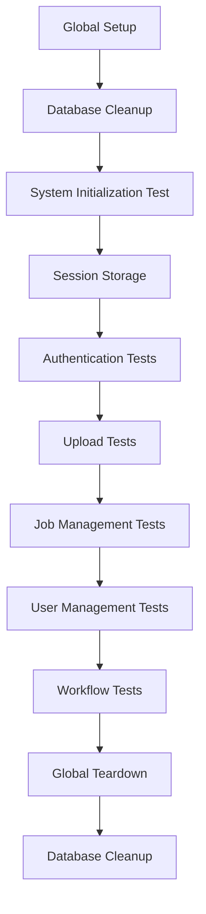
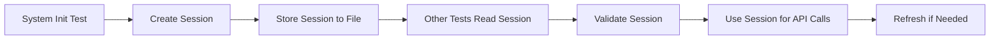

# E2E Test Refactor Plan

## Overview

This document outlines the refactoring of the e2e tests to have smaller, more focused test files with proper session management and database cleanup.

## Current Issues

1. Tests are large monolithic files (e.g., jobs.spec.ts with 598 lines)
2. Each test re-authenticates, causing redundancy
3. Tests rely on DISABLE_AUTH environment variable
4. No proper database cleanup between test runs
5. Session data is not shared between tests

## New Architecture

### Directory Structure

```
src/tests/e2e/
├── setup/
│   ├── database-cleanup.ts          # Database cleanup utilities
│   ├── system-initialization.spec.ts # System initialization test
│   └── session-manager.ts           # Session storage and sharing
├── auth/
│   ├── login.spec.ts                # Login functionality tests
│   ├── password-change.spec.ts      # Password change tests
│   └── auth-guards.spec.ts         # Authentication guards tests
├── jobs/
│   ├── job-creation.spec.ts         # Job creation tests
│   ├── job-monitoring.spec.ts       # Job monitoring tests
│   ├── job-control.spec.ts          # Job control (pause/stop/restart) tests
│   └── job-results.spec.ts          # Job results and export tests
├── upload/
│   ├── dictionary-upload.spec.ts    # Dictionary upload tests
│   ├── pcap-upload.spec.ts          # PCAP upload tests
│   └── file-management.spec.ts      # File management tests
├── user-management/
│   ├── user-creation.spec.ts        # User creation tests
│   ├── user-editing.spec.ts         # User editing tests
│   └── user-permissions.spec.ts     # User permissions and roles tests
├── workflows/
│   ├── basic-workflow.spec.ts       # Simple end-to-end workflow
│   └── advanced-workflow.spec.ts    # Complex workflow scenarios
├── helpers/
│   ├── test-helpers.ts              # Updated common utilities
│   ├── global-setup.ts              # Updated global setup
│   └── global-teardown.ts           # Updated global teardown
└── fixtures/                        # Test data files
```

### Test Execution Flow



### Session Management Flow



### Database Cleanup Strategy

The following tables will be cleaned before and after test runs:
- `cracked_passwords`
- `job_dictionaries`
- `job_networks`
- `job_pcaps`
- `jobs`
- `networks`
- `uploads`
- `sessions`
- `verifications`
- `accounts`
- `user_profiles`
- `users`

## Implementation Details

### 1. Database Cleanup Utilities

Create a utility that:
- Connects to the database using the existing configuration
- Truncates tables in the correct order to respect foreign key constraints
- Runs before the first test and after the last test
- Preserves database schema while removing all data

### 2. Session Manager

Create a session manager that:
- Stores authentication cookies/tokens in a temporary file
- Validates session before use
- Refreshes sessions if expired
- Provides methods to retrieve and update session data

### 3. System Initialization Test

A dedicated test that:
- Runs first to initialize the system
- Creates the superuser account
- Handles initial password change
- Stores the session for subsequent tests

### 4. Test File Breakdown

Break down large test files into smaller, focused files:
- **Jobs**: 4 files instead of 1 (creation, monitoring, control, results)
- **Auth**: 3 files instead of 1 (login, password change, guards)
- **Upload**: 3 files instead of 1 (dictionary, pcap, management)
- **User Management**: 3 files instead of 1 (creation, editing, permissions)

### 5. Updated Test Helpers

Modify test helpers to:
- Support session persistence
- Remove reliance on DISABLE_AUTH
- Provide methods for session validation and refresh
- Include database cleanup utilities

## Benefits

1. **Faster test execution**: No need to re-authenticate for each test
2. **Better maintainability**: Smaller, focused test files
3. **Clean test state**: Proper database cleanup ensures isolated tests
4. **Realistic testing**: Tests run with authentication enabled
5. **Improved debugging**: Easier to identify issues in smaller test files

## Migration Strategy

1. Create new directory structure
2. Implement database cleanup utilities
3. Create session manager
4. Extract system initialization test
5. Break down existing test files
6. Update test helpers
7. Update global setup/teardown
8. Update Playwright configuration
9. Update documentation
10. Test the new structure

## Compatibility

This refactoring will:
- Maintain all existing test coverage
- Use existing database schema and configuration
- Work with existing test fixtures
- Preserve all current functionality

## Timeline

1. Week 1: Implement database cleanup and session management
2. Week 2: Extract system initialization and update test helpers
3. Week 3: Break down and refactor test files
4. Week 4: Finalize configuration and documentation